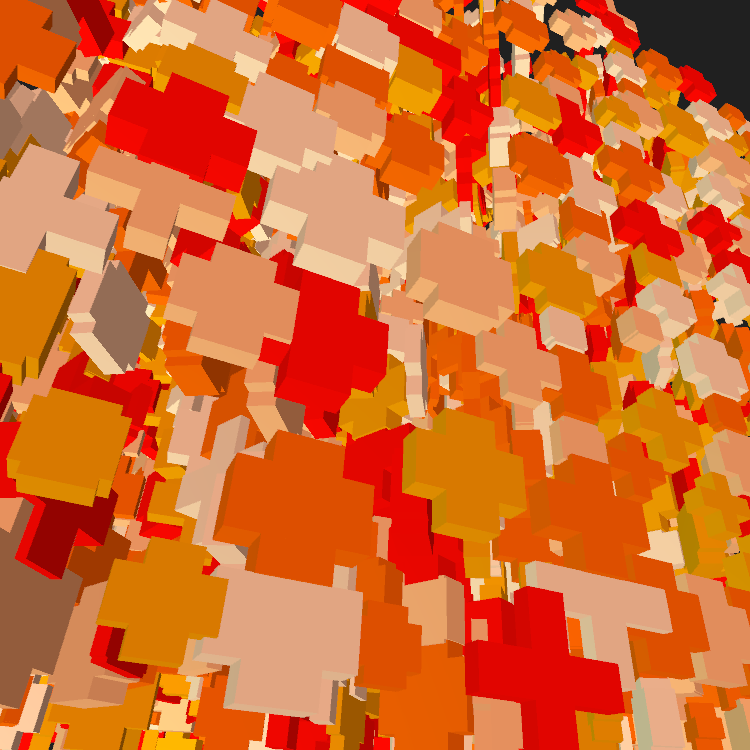
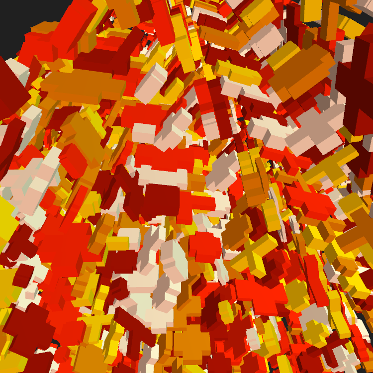
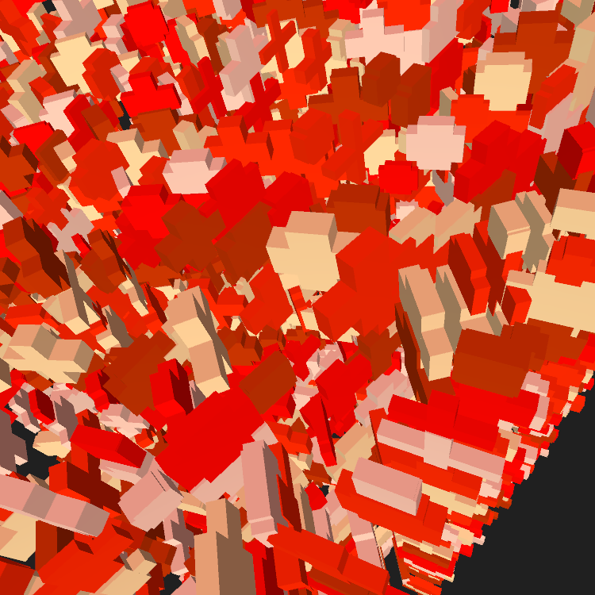
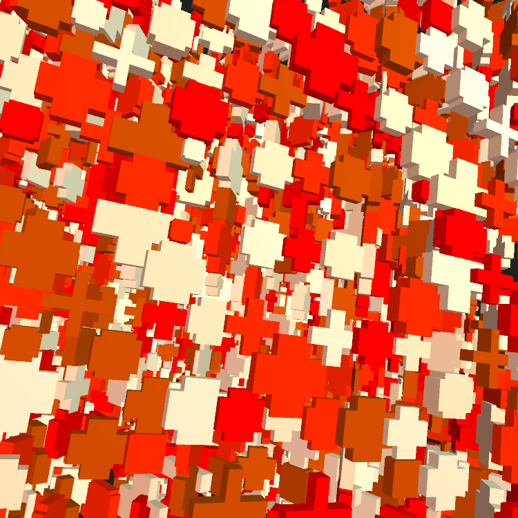

# GENUARY 2021

## Descripción
Participando en GENUARY 2021. Un desafío generativo al día

## Día 1. Triple nested loop
   

https://github.com/svcnt/GENUARY/tree/master/V01/sketch

## Referencias
https://genuary2021.github.io/?fbclid=IwAR1KjJ7Bs-bGz0EweHzec5Ya3qz6n4JJGrtIfJNTU7ImNXEJ4NWZfZoCzJA
